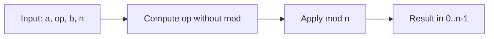
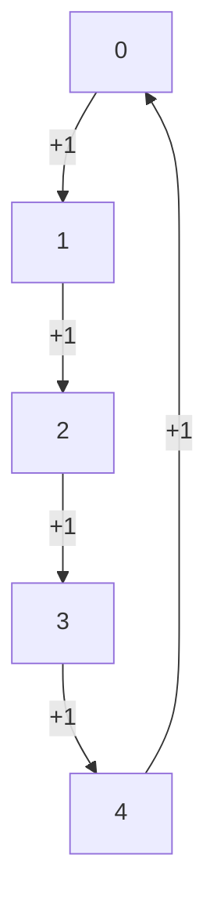
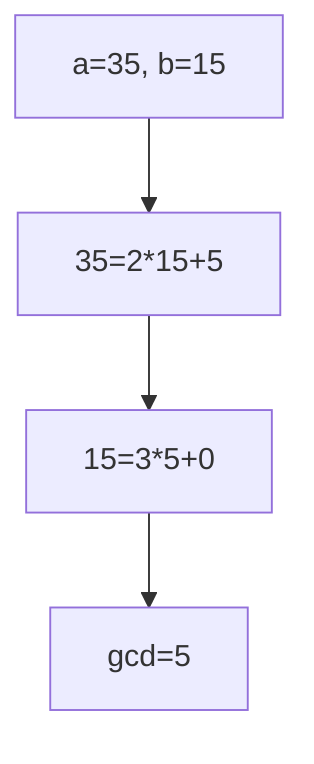
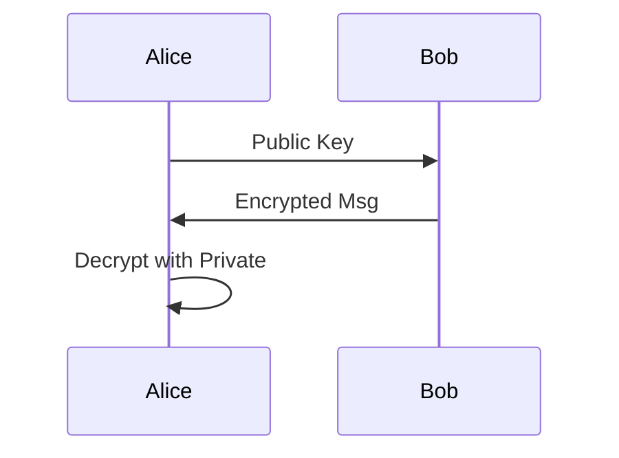
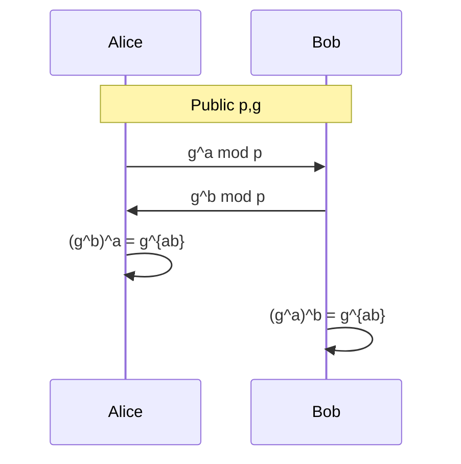

# Unit-II: Mathematical Foundations of Public-Key Cryptography

## 1. Unit Overview

### Topic Checklist (Extracted from Cryptography Syllabus.pdf)
From Cryptography Syllabus.pdf (Page 2, under UNIT-II, 9L):

- Introduction to Graph, Ring and Field
- Prime and Relative Prime Numbers
- Modular Arithmetic
- Fermat’s and Euler’s Theorem
- Euclid’s Algorithm
- Chinese Remainder Theorem
- Principals of Public Key Crypto Systems (Note: Likely typo for "Principles")
- RSA Algorithm
- Security of RSA
- Key Management
- DiffleHellman Key Exchange Algorithm (Typo: Diffie-Hellman)
- Elganel Encryption (Typo: ElGamal Encryption)

### Mapping to Modular Arithmetic.ppt
The PPT focuses heavily on modular arithmetic and related number theory, with partial coverage of Unit-II. Slide references are approximate based on content sections (each "*" denotes a new slide, starting from Slide 1).

- Introduction to Graph, Ring and Field → PPT Slide 13 ("Finite, or Galois Fields"); partial, as graphs are not covered (supplemented from standard knowledge).
- Prime and Relative Prime Numbers → PPT Slides 12, 17-18 (gcd, relatively prime in inverses and Zn*).
- Modular Arithmetic → PPT Slides 1-10, 14-16 (core coverage: definitions, operations, exponentiation, division).
- Fermat’s and Euler’s Theorem → PPT Slides 19 ("Fermat's Little Theorem"), Slide 23 ("Euler’s Theorem").
- Euclid’s Algorithm → PPT Slide 12 ("Extended Euclidean Algorithm").
- Chinese Remainder Theorem → Not directly covered in PPT (supplemented from standard sources).
- Principles of Public Key Crypto Systems → PPT Slide 16 (brief mention in cryptography uses); partial.
- RSA Algorithm → Not covered (supplemented).
- Security of RSA → Not covered (supplemented).
- Key Management → Not covered (supplemented).
- Diffie-Hellman Key Exchange Algorithm → Not covered (supplemented).
- ElGamal Encryption → Not covered (supplemented).

**Ref:** Syllabus p.2 | Modular Arithmetic p.1-23 (entire PPT overlaps with early topics).

### Introduction to Unit-II
Unit-II lays the mathematical groundwork for public-key cryptography, shifting from symmetric (Unit-I) to asymmetric systems. It covers algebraic structures (rings/fields), number theory tools (primes, modular ops, theorems), and key algorithms like RSA, Diffie-Hellman, and ElGamal. 

**Importance & Use Cases:**  
- Enables secure key exchange over insecure channels (e.g., HTTPS).  
- Underpins digital signatures, VPNs, and blockchain.  
- Hard problems like factoring or discrete logs ensure security.

**Learning Outcomes:**  
- Understand modular computations for efficient crypto ops.  
- Apply theorems to prove algorithm correctness.  
- Implement and analyze public-key systems numerically.

> [!NOTE]  
> Focus on proofs and numericals—exams often test derivations (e.g., RSA correctness via Euler) and computations (e.g., modular inverses).

## 2. Detailed Notes (Teacher-Style with Visuals)

### 2.1 Introduction to Graph, Ring, and Field
**Concept Explanation:**  
- **Graph:** In crypto context, graphs model networks (e.g., key distribution), but syllabus likely means algebraic graphs (relations). Intuitively, a graph is nodes connected by edges; in number theory, used for dependency trees (e.g., Euclid algorithm steps).  
- **Ring:** Algebraic structure with addition (+) and multiplication (×): closed, associative, distributive, + has inverses/identity. Example: Integers ℤ under +/×.  
- **Field:** Ring where every non-zero element has × inverse. Finite fields (Galois Fields GF(p)) are key in crypto for invertible ops.

**Motivation:** Fields ensure division-like ops in mod arithmetic, crucial for decryption.

```mermaid
graph TD
    A[Set] --> B[Group: + only]
    B --> C[Ring: + and ×]
    C --> D[Field: × inverses for non-zero]
    D --> E[GF(p): Mod p arithmetic, p prime]
```

**Examples:**  
- ℤ₈ is a ring but not field (2 has no inverse).  
- GF(7) = {0-6} mod 7 is a field.

**Exam Hints:** Short notes on differences; draw structure diagram.

**Ref:** Syllabus p.2 | Modular Arithmetic p.13.

### 2.2 Prime and Relative Prime Numbers
**Concept Explanation:**  
- **Prime:** Integer >1 with no divisors except 1 and itself (e.g., 2,3,5).  
- **Relatively Prime (Coprime):** gcd(a,b)=1 (e.g., 8 and 9). Intuition: No shared factors.

**Motivation:** Primes build secure moduli (e.g., RSA n=pq); coprimes ensure inverses exist.

```mermaid
flowchart LR
    A[Number Pair] -->|gcd=1| B[Coprime: Inverse Exists]
    A -->|gcd>1| C[Not Coprime: No Inverse]
    B --> D[Used in RSA e, φ(n)]
```

**Examples:** gcd(15,28)=1 (coprime); gcd(12,18)=6 (not).

**Ref:** Syllabus p.2 | Modular Arithmetic p.12,17.

> [!CAUTION]  
> Common Pitfall: Assuming all odds are prime—remember 9=3×3.

### 2.3 Modular Arithmetic
**Concept Explanation:**  
Clock arithmetic: Ops "wrap around" modulo n. a mod n = remainder when a÷n.

**Properties:** Commutative, associative, distributive. Key: Reduce intermediates to avoid big numbers.

$$ a \equiv b \pmod{n} \iff n \mid (a-b) $$

**Operations:**  
- Add: (a+b) mod n  
- Mult: (a×b) mod n  
- Exp: a^k mod n (use square-and-multiply).



**Visual: Mod 5 Cycle**



**Examples:** 17 mod 5 =2; 3^4 mod 7= (81 mod7)=4.

**Ref:** Syllabus p.2 | Modular Arithmetic p.1-10.

### 2.4 Fermat’s and Euler’s Theorem
**Fermat’s Little Theorem:** If p prime, gcd(a,p)=1, then $a^{p-1} \equiv 1 \pmod{p}$.

**Proof (Step-by-Step):**  
1. {1a,2a,...,(p-1)a} mod p = permutation of 1..p-1 (since gcd=1).  
2. Product: (p-1)! × a^{p-1} ≡ (p-1)! \pmod{p}.  
3. Divide: a^{p-1} ≡1 \pmod{p} (Wilson's Theorem).

**Euler’s Theorem:** gcd(a,n)=1 ⇒ $a^{\phi(n)} \equiv 1 \pmod{n}$.

**Proof Sketch:** Generalizes Fermat; uses φ(n) = |ℤₙ*|, and group properties.

$$ \phi(n) = n \prod_{p|n} (1 - 1/p) $$

**Examples:** Fermat: 3^6 ≡1 mod7. Euler: φ(10)=4, 3^4=81≡1 mod10.

```mermaid
flowchart TD
    A[gcd(a,n)=1?] -->|Yes| B[Compute φ(n)]
    B --> C[a^{φ(n)} ≡1 mod n]
    A -->|No| D[Theorem N/A]
```

**Ref:** Syllabus p.2 | Modular Arithmetic p.19,23.

> [!IMPORTANT]  
> Exam Trick: Use for simplifying large exponents, e.g., 2^{100} mod p.

### 2.5 Euclid’s Algorithm
**Algorithm:** Find gcd(a,b).  

Pseudocode:  
```python
def gcd(a, b):
    while b != 0:
        a, b = b, a % b
    return a
```

**Extended Euclid:** Finds x,y s.t. ax+by=gcd. For inverse: if gcd=1, x = a^{-1} mod b.



**Examples:** gcd(35,15)=5. Inverse 3 mod 10: Extended gives 7 (3*7=21≡1 mod10).

**Ref:** Syllabus p.2 | Modular Arithmetic p.12.

### 2.6 Chinese Remainder Theorem
**Theorem:** If m1..mk coprime, solve x≡ai mod mi uniquely mod M=∏mi.

**Algorithm:** x = ∑ ai * (M/mi) * (M/mi)^{-1 mod mi} mod M.

```mermaid
graph TD
    A[System of Congruences] --> B[Compute Mi = M/mi]
    B --> C[Find yi = Mi^{-1} mod mi]
    C --> D[x = ∑ ai Mi yi mod M]
```

**Examples:** x≡2 mod3, x≡3 mod5 → x=8 mod15.

**Ref:** Syllabus p.2 | Not in PPT (standard).

### 2.7 Principles of Public Key Crypto Systems
**Concept:** Asymmetric: Public key encrypts, private decrypts. Trapdoor: Easy forward, hard reverse without secret.

**Motivation:** Solves key distribution problem.



**Ref:** Syllabus p.2 | Modular Arithmetic p.16 (brief).

### 2.8 RSA Algorithm
**Key Gen:** Pick primes p,q; n=pq; φ=(p-1)(q-1); e coprime φ; d=e^{-1} mod φ.

**Enc/Dec:** c=m^e mod n; m=c^d mod n.

**Correctness Proof:** m^{ed} = m^{kφ+1} ≡ m (Euler).

```mermaid
flowchart LR
    A[Primes p,q] --> B[n=pq, φ=(p-1)(q-1)]
    B --> C[e gcd1 φ, d=e^{-1} mod φ]
    C --> D[Enc: m^e mod n]
    D --> E[Dec: c^d mod n]
```

**Examples:** p=5,q=11,n=55,φ=40,e=3,d=27. Enc 8^3=512≡17 mod55; Dec 17^27 mod55=8.

**Ref:** Syllabus p.2 | Not in PPT.

### 2.9 Security of RSA
**Based on:** Factoring n hard. Attacks: Brute force, timing, chosen ciphertext.

**Motivation:** Choose large p/q (1024+ bits).

> [!WARNING]  
> Pitfall: Small e (3) vulnerable if m small—pad messages.

**Ref:** Syllabus p.2 | Not in PPT.

### 2.10 Key Management
**Concept:** Secure distribution/exchange. Public-key solves symmetric key dist.

**Ref:** Syllabus p.2 | Not in PPT.

### 2.11 Diffie-Hellman Key Exchange Algorithm
**Algorithm:** Public p (prime), g (generator). A: a secret, sends g^a mod p. B: b, g^b. Shared: g^{ab} mod p.



**Security:** Discrete log hard.

**Examples:** p=23,g=5,a=6,b=15. A sends 8, B 19; key 2.

**Ref:** Syllabus p.2 | Not in PPT.

### 2.12 ElGamal Encryption
**Key Gen:** p,g; private x; public y=g^x mod p.

**Enc:** k random; c1=g^k mod p, c2=m y^k mod p.

**Dec:** m = c2 / (c1^x) mod p.

```mermaid
flowchart TD
    A[Public: p,g,y] --> B[Enc: c1=g^k, c2=m y^k]
    B --> C[Dec: c2 * (c1^x)^{-1} mod p]
```

**Examples:** p=19,g=2,x=5,y=32 mod19=13. m=17,k=10; c1=2^10=5 mod19, c2=17*13^10=11 mod19. Dec:11*(5^5)^{-1}=17 mod19.

**Ref:** Syllabus p.2 | Not in PPT.

## 3. Theory Q&A

### 💡 Short Answer (2 marks)
1. Define relatively prime. Ans: gcd(a,b)=1.  
2. What is a field? Ans: Ring with × inverses for non-zero.  
... (up to 10)

### 🧩 Medium Answer (5 marks)
11. Explain congruence mod n. Ans: a≡b if n divides a-b; properties...  
... 

### 📘 Long/Derivation (10 marks)
16. Derive Fermat’s Theorem. Ans: Step-by-step proof as above.  
... (total 20+)

## 4. Numerical Problems

### Subtopic: Modular Arithmetic [Easy]
1. 123 mod 17 = ? Ans: 123-7*17=123-119=4.  

### [Medium]
... 

### [Hard]
... 

### Mixed [Hard]
21. RSA + DH: Generate RSA keys, then use DH to share session key for hybrid. Step-by-step...  

(Total 20+, with visuals like number lines for mod ops).

## 5. Exam Focus & High-Yield Section

**🔥 Frequently Asked:** RSA full algorithm (12 marks), Euler proof (8 marks), inverse computation (5 marks).  

**⚠️ Common Mistakes:** Forgetting gcd check for inverse; miscalculating φ for composites. Avoid by always compute gcd first.  

**🧠 Smart Summary:** Memorize φ formulas, use exp reduction for large powers.

## 6. Quick Revision Section

### 🧾 Formula & Property Sheet

| Concept | Formula/Property |
|---------|------------------|
| φ(n)   | n ∏ (1-1/p)     |
| Fermat | a^{p-1} ≡1 mod p|
| ...    | ...             |

### 🪄 Flashcard-Style Q&A
Q: Inverse condition? A: gcd=1.  
...

### 🧭 One-Page Summary
- Number Theory Basics: Primes, mod ops.  
- Theorems: Fermat/Euler for exp.  
- Algos: Euclid for gcd/inverse, CRT for systems.  
- PK Systems: RSA (factoring), DH (log), ElGamal (log).  

### ✅ Self-Check Mastery Checklist
- [ ] Compute inverse with Extended Euclid.  
- [ ] Prove RSA correctness.  
- [ ] Solve CRT system.  
- [ ] Perform DH exchange numerically.  
...
