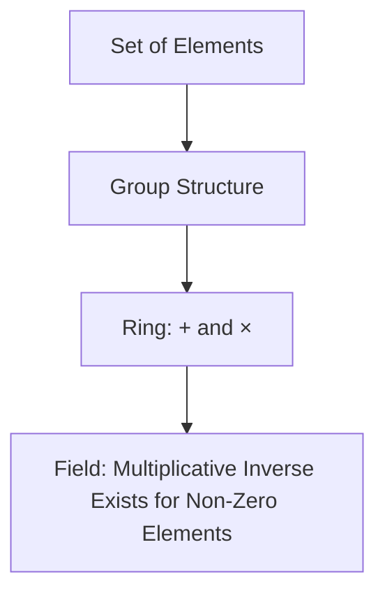
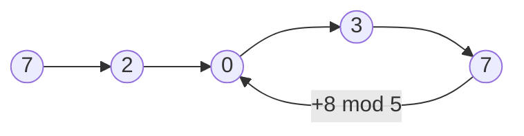
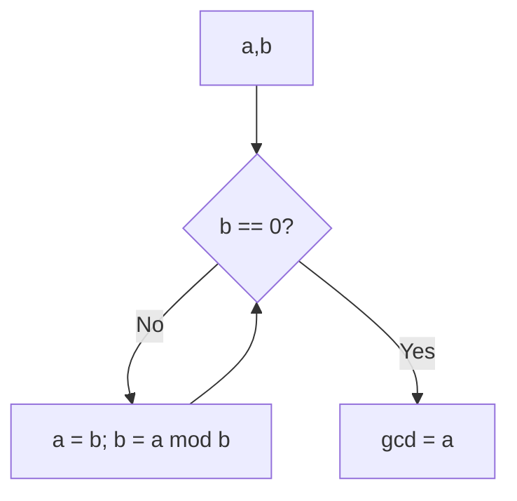
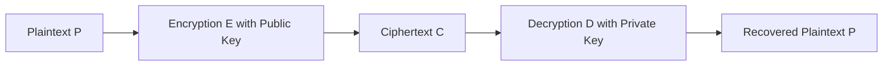
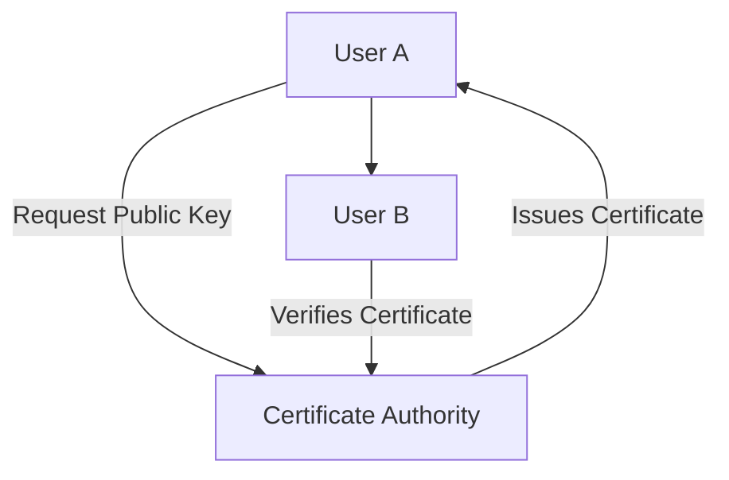
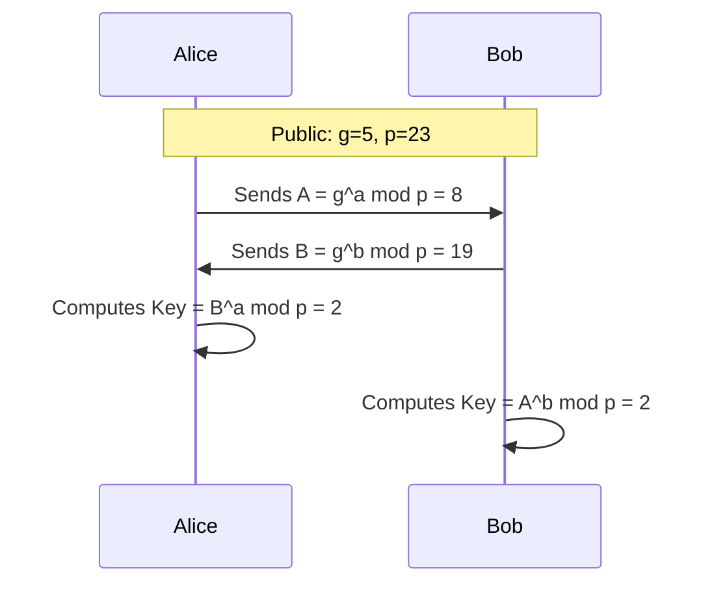

# 🧠 Cryptography — Unit 2: Number Theory and Public Key Cryptography

---

## 📘 Table of Contents

1. [Mathematical Foundations](#1-mathematical-foundations)
2. [Important Theorems](#2-important-theorems)
3. [Principles of Public Key Cryptosystems](#3-principles-of-public-key-cryptosystems)
4. [RSA Algorithm](#4-rsa-algorithm)
5. [Key Management](#5-key-management)
6. [Diffie–Hellman Key Exchange](#6-diffiehellman-key-exchange)
7. [ElGamal Encryption](#7-elgamal-encryption)
8. [Exam Theory Q&A](#8-exam-theory-qa)
9. [Solved Numerical Problems](#9-solved-numerical-problems)
10. [Exam Focus & High-Yield Topics](#10-exam-focus--high-yield-topics)
11. [Quick Revision & Formula Sheet](#11-quick-revision--formula-sheet)

---

## 1️⃣ Mathematical Foundations

### 🔹 Graphs, Rings, and Fields

| Concept   | Definition                                                                           | Example                            |
| --------- | ------------------------------------------------------------------------------------ | ---------------------------------- |
| **Group** | Set with one operation satisfying closure, associativity, identity, and inverse.     | Integers under addition (ℤ, +)     |
| **Ring**  | Set with two operations (+, ×), forming an abelian group under + and closed under ×. | Integers ℤ                         |
| **Field** | A ring with multiplicative inverses for all non-zero elements.                       | Real numbers ℝ, Galois Field GF(p) |



### 🔹 Prime & Relative Prime Numbers

* **Prime:** A number > 1 divisible only by 1 and itself.
* **Relatively Prime:** gcd(a, b) = 1.

**Example:** gcd(14, 15) = 1 → Relatively prime.

### 🔹 Modular Arithmetic

Operation performed with respect to a modulus **n**.

[ a \equiv b \pmod{n} \iff n \mid (a - b) ]

#### Modular Addition Example

[ (7 + 8) \mod 5 = 15 \mod 5 = 0 ]



#### Modular Multiplication Example

[ (3 \times 4) \mod 5 = 12 \mod 5 = 2 ]

---

## 2️⃣ Important Theorems

### 🔹 Fermat’s Little Theorem

If *p* is prime and *a* is not divisible by *p*:
[ a^{p-1} \equiv 1 \pmod{p} ]

**Proof Sketch:**
Using modular multiplicative inverses, the set {a, 2a, 3a, ..., (p−1)a} forms a permutation mod *p*.

**Example:**
[ a = 2, p = 7 → 2^6 \mod 7 = 64 \mod 7 = 1 ]

### 🔹 Euler’s Theorem

[ a^{\phi(n)} \equiv 1 \pmod{n}, \text{ if gcd(a,n)=1} ]

**Example:** n = 10, φ(10) = 4 → 3⁴ mod 10 = 81 mod 10 = 1

### 🔹 Euclid’s Algorithm

Find gcd(a, b).

**Pseudocode:**

```text
function gcd(a, b):
  while b ≠ 0:
    r = a mod b
    a = b
    b = r
  return a
```



**Example:** gcd(56, 15)
→ 56 mod 15 = 11 → gcd(15,11)
→ 15 mod 11 = 4 → gcd(11,4)
→ 11 mod 4 = 3 → gcd(4,3)
→ 4 mod 3 = 1 → gcd(3,1)
✅ gcd = 1

### 🔹 Chinese Remainder Theorem

If n₁, n₂, …, nₖ are pairwise coprime, the system
[ x \equiv a_i \pmod{n_i} ]
has a unique solution modulo N = n₁·n₂·…·nₖ.

**Example:**
[
\begin{cases}
x \equiv 2 \pmod{3}\
x \equiv 3 \pmod{5}
\end{cases}
]
→ x = 8 mod 15 ✅

---

## 3️⃣ Principles of Public Key Cryptosystems

| Aspect   | Symmetric Key                      | Public Key                         |
| -------- | ---------------------------------- | ---------------------------------- |
| Keys     | Same key for encryption/decryption | Different keys                     |
| Speed    | Fast                               | Slower                             |
| Security | Shared key risk                    | Secure via mathematical complexity |

**Mathematical Model:**
[ C = E_{K_{pub}}(P), \quad P = D_{K_{priv}}(C) ]



---

## 4️⃣ RSA Algorithm

### Algorithm Steps

1. Choose primes p, q.
2. Compute n = p·q.
3. Compute φ(n) = (p−1)(q−1).
4. Choose e such that 1 < e < φ(n) and gcd(e, φ(n)) = 1.
5. Compute d ≡ e⁻¹ mod φ(n).

Encryption: ( C = P^e \mod n )
Decryption: ( P = C^d \mod n )

```mermaid
flowchart LR
A[Select p,q] --> B[Compute n=p*q]
B --> C[Compute φ(n)=(p-1)(q-1)]
C --> D[Select e coprime to φ(n)]
D --> E[Compute d=e⁻¹ mod φ(n)]
E --> F[Public Key (e,n)]
E --> G[Private Key (d,n)]
```

**Example:**

* p=7, q=11 → n=77, φ(n)=60
* e=13 → d=37
* Encrypt P=5 → C=5¹³ mod 77 = 26
* Decrypt: 26³⁷ mod 77 = 5 ✅

---

## 5️⃣ Key Management

### 🔹 Types

1. **Manual Distribution**
2. **Automated via Key Distribution Center (KDC)**
3. **Public Key Infrastructure (PKI)**



### 🔹 Public Key Certificates

* Issued by **Certificate Authority (CA)**
* Contains public key, owner identity, and CA signature.

---

## 6️⃣ Diffie–Hellman Key Exchange

### Steps:

1. Publicly agree on prime *p* and base *g*.
2. User A chooses secret *a*, sends A = gᵃ mod p.
3. User B chooses secret *b*, sends B = gᵇ mod p.
4. Shared key = g^{ab} mod p.

**Example:**

* p=23, g=5
* A chooses a=6 → A=5⁶ mod 23=8
* B chooses b=15 → B=5¹⁵ mod 23=19
* Shared key: 19⁶ mod 23=8¹⁵ mod 23=2 ✅



---

## 7️⃣ ElGamal Encryption

**Steps:**

1. Choose prime p, base g.
2. Choose private key x.
3. Compute y = gˣ mod p.

Public key: (p, g, y) | Private key: x

Encryption:
[ C_1 = g^k \mod p, \quad C_2 = M·y^k \mod p ]
Decryption:
[ M = C_2 · (C_1^x)^{-1} \mod p ]

**Example:**

* p=23, g=5, x=6 → y=8
* Random k=10, M=9 → C₁=9, C₂=18
* Decrypt → 18·(9⁶)⁻¹ mod 23 = 9 ✅

---

## 8️⃣ Exam Theory Q&A

### 💡 Short Answer (2 Marks)

1. Define modular arithmetic.
2. What is a field in cryptography?
3. Write the formula for Euler’s theorem.
4. Define public and private keys.

### 🧩 Medium Answer (5 Marks)

1. Explain Fermat’s and Euler’s theorem with examples.
2. Differentiate symmetric and asymmetric encryption.
3. Describe Euclidean algorithm for gcd with flowchart.

### 📘 Long/Derivation (10 Marks)

1. Derive RSA encryption and decryption mathematically.
2. Explain Diffie–Hellman key exchange with numerical example.
3. Prove Euler’s theorem and state its use in RSA.

---

## 9️⃣ Solved Numerical Problems

### Example 1 — [Easy]

Compute 3⁴ mod 5.
[ 3^4 = 81 → 81 \mod 5 = 1 ]

### Example 2 — [Medium]

Find gcd(45, 10) using Euclid.
45 mod 10 = 5 → 10 mod 5 = 0 → gcd = 5

### Example 3 — [Hard]

Use CRT for:
[ x ≡ 1 \pmod{3}, x ≡ 2 \pmod{5}, x ≡ 3 \pmod{7} ]
→ N=105, x=23 ✅

### Integrated Problem — RSA + CRT

Given p=11, q=17, e=7, encrypt P=9.
φ(n)=160, d=23 → C=9⁷ mod 187=4 → P=4²³ mod 187=9 ✅

---

## 🔥 10️⃣ Exam Focus & High-Yield Topics

| Topic                  | Weight | Remarks                                   |
| ---------------------- | ------ | ----------------------------------------- |
| RSA Algorithm          | ⭐⭐⭐⭐   | Always asked, both numerical + derivation |
| Euler & Fermat Theorem | ⭐⭐⭐    | Proof + example                           |
| Diffie–Hellman         | ⭐⭐⭐    | Short + example                           |
| CRT                    | ⭐⭐     | Conceptual & numerical                    |
| ElGamal                | ⭐⭐     | Emerging topic                            |

⚠️ **Common Mistakes**:

* Confusing gcd with φ(n)
* Forgetting mod reduction after each step
* Mixing e and d in RSA

---

## 🧠 11️⃣ Quick Revision & Formula Sheet

| Concept          | Formula                 |
| ---------------- | ----------------------- |
| Fermat’s Theorem | a^{p−1} ≡ 1 (mod p)     |
| Euler’s Theorem  | a^{φ(n)} ≡ 1 (mod n)    |
| RSA Encryption   | C = P^e mod n           |
| RSA Decryption   | P = C^d mod n           |
| CRT              | x = Σ a_i·M_i·y_i mod N |
| Diffie–Hellman   | K = g^{ab} mod p        |

### 🪄 Flashcards

* **Q:** Why is RSA secure?
  **A:** Based on difficulty of factoring large integers.
* **Q:** What ensures Diffie–Hellman secrecy?
  **A:** Discrete logarithm problem.

### ✅ Mastery Checklist

* [x] Understand modular arithmetic
* [x] Apply Euler’s & Fermat’s theorem
* [x] Perform RSA encryption/decryption
* [x] Explain key exchange systems
* [x] Solve CRT-based problems

---

> 🧾 **Prepared by:** AI Study Companion for Cryptography
> 📅 **Exam Focus:** Unit 2 — Number Theory & Public Key Cryptography
> ⚙️ Based on syllabus 【5†Cryptography Syllabus.pdf】
